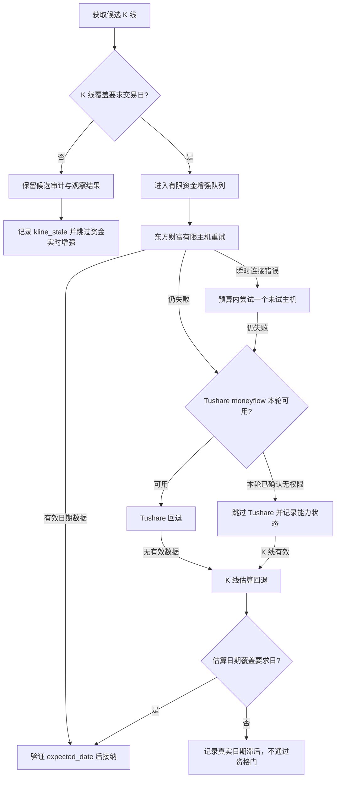

# 候选扫描资金面 K 线前置与回退链修复方案

## 目标

减少候选扫描中由过期 K 线引起的无效资金请求和错误归因，改善东方财富资金接口的瞬时连接恢复，并避免在同一轮扫描中反复调用已确认无权限的 Tushare `moneyflow` 接口。

候选资金数据仍必须覆盖要求的交易日。任何网络重试或估算结果都不得绕过日期校验；K 线估算仍标记为估算来源，不得冒充实测主力资金流。

## 事故证据

报告 `reports/lists/candidates-20260916-213745.html` 的资金源审计记录为：

| 指标 | 数值 |
|---|---:|
| 资金逻辑请求 | 41 |
| 子进程 Provider 尝试 | 41 |
| 缓存命中 | 0 |
| 失败结果 | 16 |
| 熔断数 | 0 |
| 失败原因 | `stale_data: 16` |

这里的 `Provider 尝试=41` 是扫描器启动资金 fetcher 子进程的次数，不是东方财富、Tushare 等底层 HTTP 请求次数。当前底层回退链失败细节在候选证据中，但没有汇总各数据源实际请求数，因此顶层审计容易被误读为 41 次物理 API 请求。

报告和推荐快照显示，6 只最终进入“数据未通过”的候选，K 线停在 2026-09-09、09-11 或 09-15。其资金失败证据包含：

```text
东方财富 Remote end closed connection without response
→ Tushare moneyflow 无权限，未返回有效数据
→ kline_estimate 最新日期早于 2026-09-16
→ stale_data / item_date_lagging
```

数据源状态仍为 `healthy` 且熔断数为 0，表示没有触发源级熔断，不代表这 16 个单标的结果有效。当前单个失效候选仍可能进入资金优先队列；所有资本来源失败后，fetcher 会读取本地 `kline.json` 做估算。该文件过期时，估算也只能是过期数据。

## 期望数据流



## 实施范围

### 1. 将 K 线日期资格用作资金队列前置条件

修改 `.claude/skills/stock-trend/scripts/scans/stock_scanner.py` 的 `run_phase2()` 及全局资金队列/补充队列构建逻辑。

- 继续保留 K 线过期但有足够历史数据的候选，用于当前观察结果和审计；不要因此改变研究人群边界。
- 建立单独的资金增强资格集合：只有 K 线通过现有 `_kline_usable()` 检查并覆盖 `as_of_date` 的候选，才可以进入初始资金队列或 top-up 队列。
- K 线不合格的候选记录 `attempted=false`、`status=skipped_kline_prerequisite`，同时保留 `expected_date` 与 K 线实际最新日期；不得记作资金 Provider 失败、`stale_data` 或熔断。
- 保留候选原有 `kline_stale` 质量原因和推荐门槛。资金增强跳过是上游资格导致的调度结果，不额外制造“已请求但过期”的资金错误。
- 资金估算函数继续自行验证估算结果日期；有效 K 线不代表估算一定能满足目标交易日，未满足时仍拒绝该资金数据。
- 增加 `capital_skipped_kline_prerequisite` 计数，并在性能审计中与 live success、provider failure、cache hit、deadline omission 分开列出。

### 2. 只为可重试的瞬时连接问题增加有限恢复

修改 `.claude/skills/stock-trend/scripts/fetchers/capital_flow.py` 和必要的 `core/eastmoney_utils.py`。

- 当前资金接口调用 `rotate_push2_host(..., max_retries=2)`，只尝试两个配置主机。修复时先把实际使用的主机名及次数写入结构化证据，避免将“全节点失败”误当作已尝试所有配置主机。
- 仅在连接中断/重置等明确瞬时网络错误时，预算内再试一个尚未尝试的主机；每轮不可重复已用主机，设置单次额外重试上限。
- 不对空响应、格式错误或日期落后做连接重试。保持 fetcher 子进程的现有总超时和扫描总预算，不能让重试侵占报告收尾预算。
- 日志和审计分别记录逻辑资金请求数、东财主机尝试数、Tushare 请求数、K 线估算尝试数及失败原因。`provider_attempts` 字段需明确表示层级或拆成独立计数，避免将子进程数冒充物理 API 次数。
- 所有返回数据仍经过 expected-date 校验。重试不能把旧日期结果变为 fresh。

### 3. 对 Tushare 权限失败做本轮能力熔断

修改 `.claude/skills/stock-trend/scripts/fetchers/capital_flow.py`，并在 `.claude/skills/stock-trend/scripts/scans/stock_scanner.py` 与 `.claude/skills/stock-trend/scripts/core/source_health.py` 贯通本轮状态。

- 将 Tushare 返回的 `moneyflow` 权限不足映射为稳定的 `permission_denied`，并保留在逐 Provider `failure_chain` 中；不要把权限错误压成通用 `empty`。
- 首次明确确认无权限后，只关闭当前扫描运行中的 Tushare `moneyflow` 回退。后续候选仍可请求东方财富，不能因此将整个资金源标为不可用。
- 因资金 fetcher 由扫描器逐标的启动为子进程，需由父进程接收结构化能力状态，并显式传入后续子进程；不依赖子进程环境中的临时全局变量。
- 能力状态仅在本轮扫描有效，不持久化到用户级配置或之后的运行；外部权限变更应在新运行中重新探测。
- 停用 Tushare 回退后，继续执行已有 K 线估算回退，但只接受覆盖 expected-date 的估算结果。
- 非权限类 Tushare 错误仍按现有回退策略处理，不误触发权限熔断。

### 4. 保持数据质量与报告诊断一致

修改 `.claude/skills/stock-trend/scripts/scans/daily_candidates.py` 及相关证据组装逻辑。

- `skipped_kline_prerequisite` 在报告中表述为“因 K 线未覆盖目标日，未启动资金增强”，注明目标日、K 线最新日期和未调用状态。
- 只有真实调用后返回旧日期的资金结果才统计为 `capital_item_date_lag` / `stale_data`。
- 源级权限不可用、单标的调用失败、调度未启动和日期滞后维持独立状态与计数。
- HTML/JSON/推荐快照均保留相同的 structured evidence；不改变正式候选推荐阈值、弱市策略、资金质量门或新闻影子规则。

## 测试与验收

更新对应回归测试：

- `.claude/skills/stock-trend/tests/test_stock_scanner.py`
- `.claude/skills/stock-trend/tests/test_capital_flow.py`
- `.claude/skills/stock-trend/tests/test_daily_candidates.py`
- `.claude/skills/stock-trend/tests/test_daily_recommendation_performance.py`

必须覆盖以下行为：

1. K 线过期候选仍可留在审计/观察结果中，但不进入资金初始队列或 top-up，且资金 Provider 调用次数为 0。
2. `skipped_kline_prerequisite` 不计入 `stale_data`、provider failures 或 source circuit-breaker failures；报告仍明确显示 K 线日期不合格。
3. K 线有效的候选正常进入东财请求；东财成功数据覆盖目标日时资金维度可用。
4. 连接错误只尝试有限的、互不重复的主机；空数据、坏格式和日期滞后不增加网络重试。
5. 同一候选的逻辑请求数与底层各源实际尝试数分别准确；失败链保留 source、reason、host（适用时）、expected date 和 latest date。
6. 首次 Tushare 权限失败后，本轮后续候选仍尝试东财，但不再调用 Tushare；新一轮重新探测。普通 Tushare 网络错误不得禁用后续回退。
7. 当估算 K 线旧于目标日，结果继续是不可用且不通过质量门；当估算日期合格，仍标记为估算来源。
8. 单标的异常、权限能力熔断和真正源级熔断互不混淆，且不突破并发和 live deadline。
9. 运行仓库强制门：
   - `python3 .claude/skills/stock-trend/tests/test_stock_trend.py`
   - `python3 .claude/skills/stock-trend/tests/test_golden.py --diff`
10. `git diff --check` 通过；不通过重新生成 golden snapshots 来隐藏非预期输出差异。

## 风险与处理

- **有效资金数据被少取**：跳过 K 线过期候选会放弃可能成功的东财资金返回，但这些候选已经无法通过 K 线新鲜度门。保留其观察/审计记录，且仅跳过本轮增强请求。
- **重试拖慢扫描**：重试限于一个未尝试主机，并受单请求 deadline 和全局预算约束；预算不足时直接进入既有回退链。
- **误判 Tushare 权限状态**：只有明确的权限响应才熔断，状态仅作用于当前扫描；网络异常和空响应不作为权限证据。
- **审计统计兼容性**：保留现有逻辑请求字段，新增逐 Provider 计数；若既有 `provider_attempts` 消费方把它理解为子进程次数，应先确认兼容契约并为新字段设独立名称。
- **历史候选输出变化**：跳过无资格候选的资金增强可能改变性能统计和失败原因文本，但不得改变可执行推荐集合；使用固定 fixture 验证这一点。

## 停止条件

所有测试证明过期 K 线不再消耗资金增强预算、Tushare 权限失败只在本轮屏蔽 Tushare、东财重试受限且日期门槛不变；审计能够区分调度跳过与 Provider 失败；两项强制质量门通过且没有未审阅的 golden 差异时，方案实施完成。
